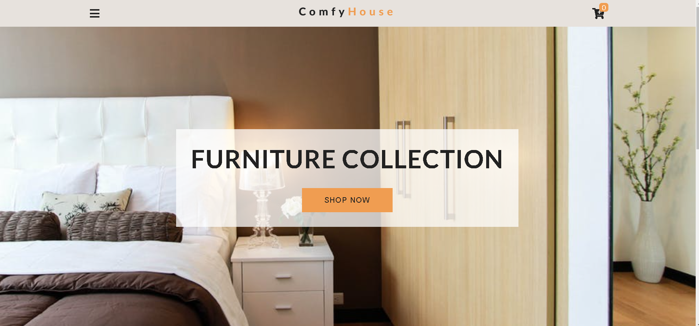
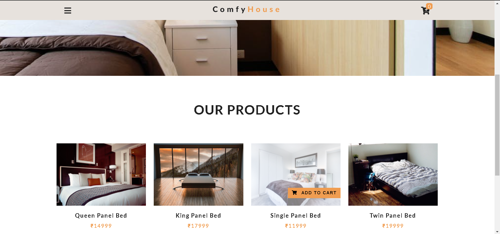
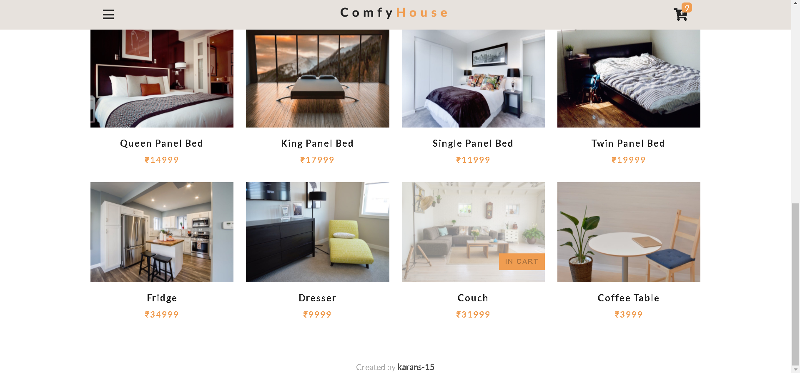
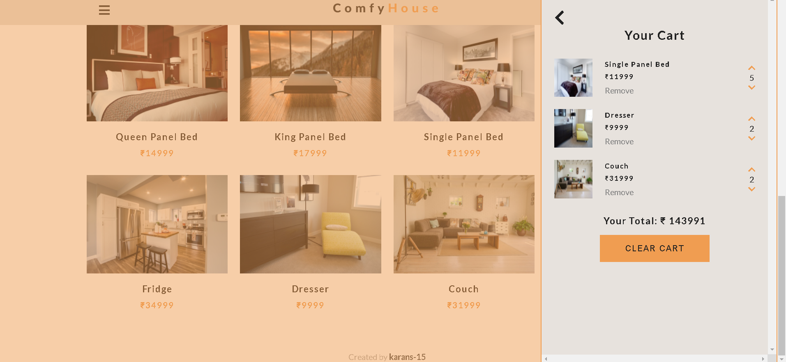
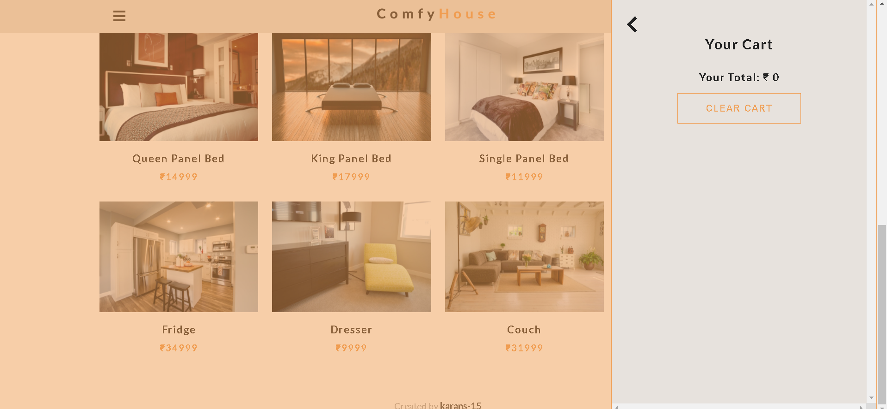

<!-- Please update value in the {}  -->

<h1 align="center">Furniture Shopping Store</h1>

<h2 align="center"><a href="https://furniture-shop-vanilla-js.netlify.app/" target="_blank">Project Website</a></h2>


<!-- TABLE OF CONTENTS -->

## Table of Contents

- Overview
  - Built With
- Features
- Website Screenshots
- How to use
- Contact Me

<!-- OVERVIEW -->

## Overview



Introduce your projects by taking a screenshot or a gif. Try to tell visitors a story about your project by answering:

- Project Website: https://furniture-shop-vanilla-js.netlify.app/ 

### Built With

<!-- This section should list any major frameworks that you built your project using. Here are a few examples.-->

- [HTML5](https://en.wikipedia.org/wiki/HTML5)
- [CSS](https://en.wikipedia.org/wiki/CSS)
- [Vanilla Js](https://en.wikipedia.org/wiki/JavaScript)

## Features
<!-- List the features of your application -->

- This website acts as a Shopping cart.
- It has all the major functionalities like:
    - Adding to Cart
    - Removing from cart
    - Clearing Cart
    - Inceasting amount 
    - Reducing amount
    - Calculating Total

- The webiste is responsive and also reacts to certain events
- The product details are extracted from Live Dynamic data uploaded on the https://www.contentful.com/ using the contentful API. One can use the json file attached if they want to use fixed static data from their local machine
- The shopping cart items are stored on your local device so even when you refresh, your items will not be lost


## Website Screenshots:






## How To Use

<!-- Example: -->

To clone and run this application, you'll need [Git](https://git-scm.com) and [Node.js](https://nodejs.org/en/download/) (which comes with [npm](http://npmjs.com)) installed on your computer. From your command line:

```bash
# Clone this repository
$ git clone https://github.com/karans_15furniture-shopping-cart

# Install dependencies
$ npm install

# Run the app
$ npm start
```

## Contact Me

- GitHub [@karans-15](https://{github.com/karans-15})
- LinkedIn [@karan-n-shah](https://www.linkedin.com/in/karan-n-shah/)
